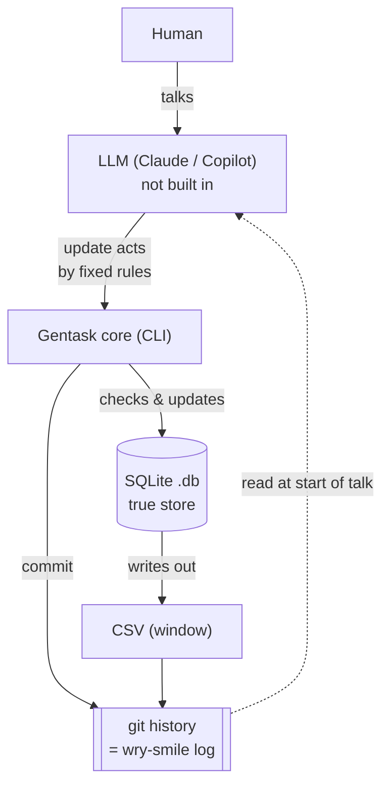
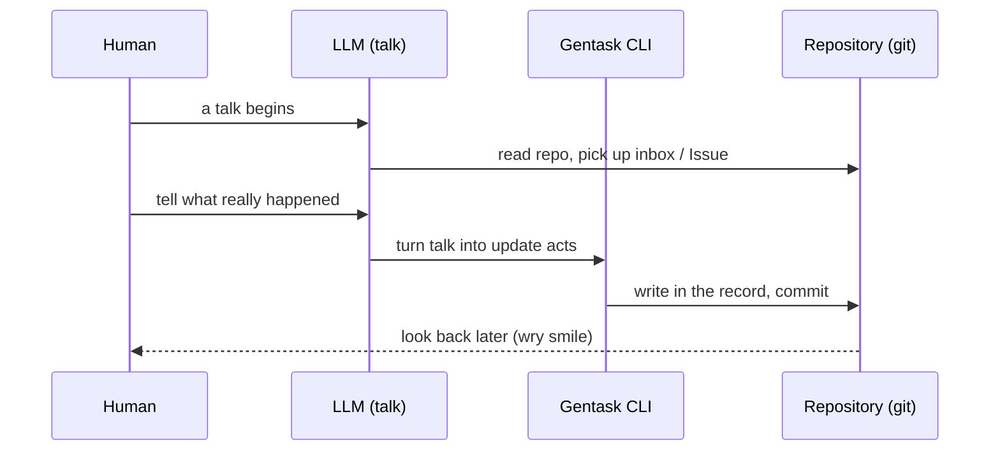

# Gentask

> **Task management where the human does not serve the tool — it keeps you able to run a monthly series.**

Gentask is a tool for putting task management the right way round again.
The human only has to live, do the work, and talk. The placing of time, the
fitting of plan to what really happened, and the record — Gentask takes all of
that on its own side.

> ⚠️ **This repository is now in a large rebuild, from the old shape
> (Google Calendar/Tasks + Gemini) to a new spec.**
> The true design is in [`docs/new_spec_gentask_JP.md`](docs/new_spec_gentask_JP.md) (Japanese).
> This README is a short form of it, and the code will follow it step by step.

---

## The idea — put the roles back the right way round

Task management was, at the start, a way to put a load outside your head: so a
person need not hold everything in mind, need not fret over the order of
things. The tool serves the human. That is how it should be.

But the tools we have turned the roles around. The human types to fit the tool,
keeps to the plan, and fixes the gaps by hand. So it is not kept up, it is left,
and it dies. Gentask puts the roles back the right way round.

- **It places (future — plan):** the LLM (through talk) reads the work model
  and gives a rough placing; the tool then makes it firm. It is not tied to
  clock times.
- **The human does not keep to it:** they slack, they do other things. That is
  not held against them.
- **The human tells what really happened, by talking:** the human types
  nowhere. They only talk. That talk is the one and only source of what is
  real.
- **It paints over afterward (past — record):** it reads the talk and writes
  down the time really used as the record.
- **It does not judge:** the record is not for looking back in blame or as a
  lesson. It is for a wry smile later — "so that's how much time went there".
  Because it does not judge, it does not die.

---

## What it keeps up

The aim of Gentask is **to keep you in a state where a monthly series can go
on.** A deadline; content that goes out to the world each month; the rhythm of
a series that keeps running — to win that back in a way that also lives
together with development work (3D and games).

As the makers who could keep up a weekly series once had an editor, what
Gentask aims to be is an **editor** at your side. But an LLM only reacts; it
cannot chase you on its own. In step with that limit, the drive comes from
three things: showing you the record, the weekly deadline, and the push of an
editor agent.

---

## How time is sorted

Time splits into "work" (your own business — the heart of it) and "life"
(all the rest). It is sorted by eight marks, in a fixed way (not left to the
LLM to judge).

| Group | Mark | Sense |
|---|---|---|
| Work | P | Plan (thought, strategy, putting into words, planning) |
| Work | T | Tech (checking, setting up, building) |
| Work | C | Create (making, design, content) |
| Work | A | Admin (running things, office work, routine) |
| Life | D | Daily life (food, bath, sleep) |
| Life | J | Job (the day job — the way money comes in) |
| Life | W | Workout (walking, pull-ups) |
| Life | M | Move (travel, commute — new making-time in the age of the LLM) |

---

## Two holders

The time line is one line. The future is rough; the past is fine.

- **Plan (kanban form — future):** tasks are stacked as cards ("this week",
  "next week", "some day"). They are **not stuck to clock times**, so nothing
  breaks when you do not keep to them.
- **Record (calendar form — past):** what you did, once told, drops in as
  **15-minute slots**. The past is fixed, so sticking it to a clock time tells
  no lie.

Before you act: no time (plan). After you act: a time (record). The gap between
the cards left in the plan (the things not done) and the slots you did not mean
to spend (YouTube, and such) is what makes the "wry smile" you look back on.

---

## Architecture (still being designed)

**"The LLM is outside; the tool is fixed."** — the same shape as
sfdc-user-tools / zcrm-tools.



| Layer | Who | Role |
|---|---|---|
| Judgment | LLM (talk = Claude/Copilot; **not built in**) | Turns talk into a set of update acts that follow fixed rules |
| Action | Gentask core (CLI tool) | Checks the acts, updates the data safely, commits to git |
| Data | SQLite (`.db` — true store) + CSV (window) | In the repository. The git history of the CSV serves as the wry-smile log |

- The language is **TypeScript**; types are plain **zod** (the old
  genkit/Gemini is dropped).
- The Gentask core **has no LLM built in.** It is only a CLI that works on
  CSV/SQLite.
- **The LLM's guesses are not trusted.** The logic is held up by unit tests
  (TDD).

### Data model (four things)
| Name | Idea | Role |
|---|---|---|
| content | A work | The unit of a series. What goes out to the world |
| task | A step of work | A step that makes a content (plot, name, 3D, and so on) |
| slot | A time block | A held 15-minute block of time. Sorted by the eight marks |
| assignment | A link | Which task, in which slot, and how it really went. **What talk paints over** |

---

## CLI (still being designed)

Gentask is a CLI app that works even when a human types the lines by hand. The
LLM is only the way in that turns talk into commands; with no LLM, a human
typing the lines directly still gets every function. The form is
`gentask <noun> <verb>` (the git/gh way). Only the daily look-up has a short
form.

```
gentask content add <title> --kind <4pnl|3dmd|...>   # make a work
gentask task add <content-uuid> <title> --mode <P|T|C|A> --sp <n>   # stack a step
gentask slot log --from 9:00 --to 11:00 --cat C     # record what you did, by range
gentask today / week                                 # look at the record (the daily trigger)
gentask sprint close                                 # close the week and carry over
```

> ⚠️ The above is a design; the code is still catching up. What is firm rests
> on [`docs/new_spec_gentask_JP.md`](docs/new_spec_gentask_JP.md) (section 10)
> and the work still to come.

---

## The starting point — that a talk has begun

The LLM only reacts: it cannot mark clock time on its own, and it cannot watch
the repository all the time. So **the starting point is "that a talk has
begun"** itself. At the way in of a talk, it reads the repository, picks up in
one go the tasks that have come from outside (Issue / inbox), writes in what was
told, and commits to git. No moment-by-moment reacting is asked for.



---

## License

MIT
