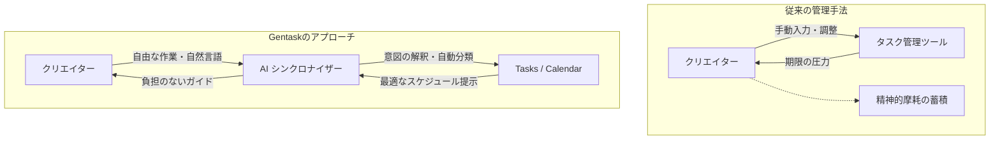

# Gentask: プロジェクト・コンセプトおよび要求仕様

## 1. 導入：Gentask 開発の背景と目的

週刊連載という極限のクリエイティブ環境において、作家を挫折させる最大の要因は「作業そのものの遅れ」ではありません。**「スケジュール管理やタスク調整にかかる精神的摩耗」**こそが真のボトルネックです。

従来のタスク管理ツールは「人間がシステム（入力規則や期限）に合わせる」ことを強要します。Gentask はこのパラダイムを逆転させ、**「人間が自身のエネルギーの赴くままに動いた結果を、AIが背後で解釈し、システム側を自動的に合わせる」**という革新的なアプローチを採用します。

### パラダイムシフトの概念図

## 2. コア・タスク概念：4つのエネルギーモード

Gentaskでは、タスクを単なる「ToDo」として扱いません。「今の自分がどのモード（エネルギー状態）にあるか」を基準に、タスクを4つのロールに分類します。

* **企画 (Planning - P):** ゼロからイチを生み出す、最も知的エネルギーを消費するモード（プロット、ネーム）。
* **技術・製造 (Tech/Create - T/C):** 設計図をもとに構築する、集中力と手を動かすモード（3Dモデル制作、レイアウト）。
* **仕上げ (Composite - C):** 最終的なクオリティを引き上げる、審美眼と細部の調整モード（エディット、投稿）。
* **調整 (Adjust - A):** 予期せぬ遅延を吸収し、全体を最適化するバッファモード。

## 3. 目指すゴール
「コード側は『どの部署（ロール）のタスクか』という抽象的な指示を出すだけ」で、環境に応じて適切にタスクが整理・同期され、クリエイターが**「描くこと」だけに100%の精神リソースを注げる環境**を構築します。
