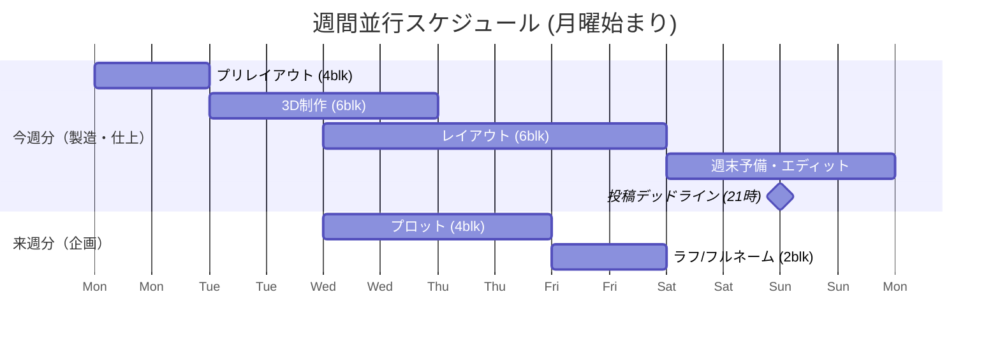

# Gentask: 運用ロジックとデータモデル

## 1. 18.0sp / 36-Block ライフサイクル

Gentaskは、1話分の作業量を **18.0sp（18時間）** と定義し、これを **36個の 0.5sp（30分）ブロック** に細分化して管理します。これにより、極限状態でも「あと何ブロックで終わるか」が視覚的かつ定量的に把握可能になります。

### 工程分解マトリクス（抜粋）

| フェーズ | 工程 | sp数 | ブロック数 | 完了条件 |
| :--- | :--- | :--- | :--- | :--- |
| **P (企画)** | プロット | 2.0 | 4 | 全セリフ・演出意図の言語化 |
| **T/C (製造)** | 3Dモデル制作 | 3.0 | 6 | ポージング・レンダリング完了 |
| **C (仕上げ)** | エディット | 2.5 | 5 | 画像加筆・エフェクト処理 |
| **--- (調整)** | 予備バッファ | 4.0 | 8 | クオリティアップ・遅延吸収 |

## 2. 並行循環型カレンダー配置

今週の「製造」タスクと、来週の「企画」タスクをカレンダー上で強制的に噛み合わせ、シームレスな連載進行を実現します。

### 週間オーバーラップ・スケジュール（Gantt）

## 3. リカバリと自動化の仕組み

* **状態スナップショット・エンジン:** AIの誤判定や操作ミスが発生した場合、システムは常に「一つ前の状態」へロールバック可能な安全装置を提供します。
* **日曜 21時の自動スライド（儀式）:** デッドラインである日曜21時を起点とし、空いた「来週分」のバケットに次々回話数のプロットタスク（4ブロック）を自動生成し、連載の永続サイクルを回します。
