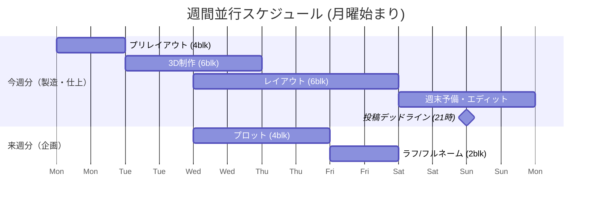

# Gentask: 運用ロジックとデータモデル

## 1. 18.0sp / 36-Block ライフサイクル

Gentaskは、1話分の作業量を **18.0sp（18時間）** と定義し、これを **36個の 0.5sp（30分）ブロック** に細分化して管理します。これにより、極限状態でも「あと何ブロックで終わるか」が視覚的かつ定量的に把握可能になります。

### 工程分解マトリクス（抜粋）

| フェーズ | 工程 | sp数 | ブロック数 | 完了条件 |
| :--- | :--- | :--- | :--- | :--- |
| **P (企画)** | プロット | 2.0 | 4 | 全セリフ・演出意図の言語化 |
| **P (企画)** | ラフ/フルネーム | 1.0 | 2 | コマ割り・表情・詳細の確定 |
| **T (技術)** | プリレイアウト | 2.0 | 4 | 3D配置前の「設計図」完成 |
| **T (技術)** | 3Dモデル制作 | 3.0 | 6 | ポージング・レンダリング完了 |
| **T (技術)** | レイアウト | 3.0 | 6 | カメラ決定・背景合成完了 |
| **C (制作)** | エディット | 2.5 | 5 | 画像加筆・エフェクト処理完了 |
| **C (制作)** | 投稿 | 0.5 | 1 | **日曜 21:00 厳守** |
| **A (調整)** | 予備バッファ | 4.0 | 8 | クオリティアップ・遅延吸収 |

## 2. 並行循環型カレンダー配置

今週の「製造」タスクと、来週の「企画」タスクをGoogle Calendarカレンダー上で強制的に噛み合わせ、シームレスな連載進行を実現します。

### 週間オーバーラップ・スケジュール（Gantt）

## 3. 週次スライドの自動化ロジック

毎週日曜 21:00（投稿完了後）に `npm run slide` を実行することで、以下の一連の処理が自動実行されます。

### T-1: 投稿完了チェック（CTASKのみ）

CTASK モードの「今週分」リストに `sub_role === 'post'` のタスクが存在し、かつ `status: completed` であることを確認します。未完了の場合はスライド処理を中断します。

> 💡 PTASK / TTASK / ATASK モードは「投稿」タスクを持たないため、このチェックはスキップします。

### T-2: アーカイブ

全モードの「今週分」リスト（`current`）のタスクを「完了」リスト（`done`）へ移動します。Google Tasks にはリスト間のネイティブ移動 API がないため、**挿入（insert）→ 削除（delete）**で実現します。

### T-3: 昇格（プロモート）

全モードの「来週分」リスト（`next`）のタスクを「今週分」リスト（`current`）へ移動し、`due` を翌月曜日 00:00 JST に設定します。

### T-4: スケジュール配置

昇格したタスクに対して Google Calendar にイベントを作成します。タスクの `sub_role` フィールドに応じてスケジュール配置ルールを適用します：

| `sub_role` | 配置ルール |
| :--- | :--- |
| `'plot'` | 水曜 14:00（1h）、木曜 14:00（1h）の 2 イベント |
| `'name'` | 金曜 14:00（1h）の 1 イベント |
| `'post'` / `'other'` | 翌月曜 09:00 から 30 分ブロックで順次配置 |

イベント作成後、**タスクのノートにイベントIDを埋め込み**双方向リンクを確立します（形式は §3 参照）。

### T-5: 次話プロット生成（PTASKのみ）

Gemini AI が次回エピソードのプロット作業タスク（最大4件）を生成し、PTASK の「来週分」リストに投入します。

## 4. リカバリと自動化の仕組み

* **状態スナップショット・エンジン:** AIの誤判定や操作ミスが発生した場合、システムは常に「一つ前の状態」へロールバック可能な安全装置を提供します。スナップショットは `~/.gentask/snapshots/{uuid}.json` に UUID キーで保存されます。
* **アンドゥ操作:** Google Calendarイベントの本文に `undo` または `戻して` と記入して `npm run sync` を実行すると、AIがアンドゥシグナルを検出し、スナップショットから以前の状態を復元します。
