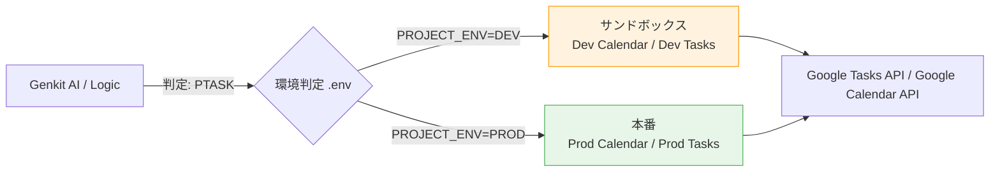
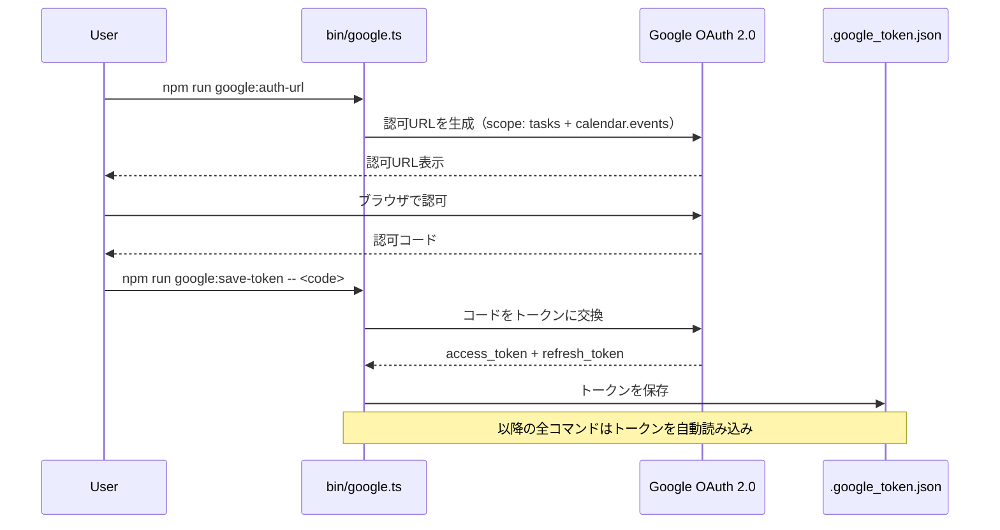

# Gentask: システムアーキテクチャとインフラ設計

## 1. コア・テクノロジースタック

| 種別 | 技術 |
| :--- | :--- |
| **AIモデル** | Google Gemini 2.0 Flash |
| **AIフレームワーク** | Genkit (`genkit` + `@genkit-ai/googleai`) |
| **タスク基盤** | Google Tasks API v1 |
| **カレンダー基盤** | Google Calendar API v3 |
| **認証** | OAuth 2.0（Google Cloud）|
| **ランタイム** | Node.js ≥ 18、TypeScript、tsx |
| **テスト** | Vitest 4.x（ESM対応）|

> Microsoft 365（Planner / Outlook / Microsoft Graph）は完全に撤去済みです。

---

## 2. 環境分離とサンドボックス設計（Dev / Prod）

論理的には4つのモード（PTASK/TTASK/CTASK/ATASK）が存在しますが、Dev と Prod で物理的なカレンダーID / OAuth トークンファイルを切り替えます。

* **Dev環境 (`.env.dev`):** 破壊的テストを安全に行うため、サンドボックス用の Google Calendar と Google Tasks を使用します。
* **Prod環境 (`.env.prod`):** 実運用用の Google Calendar と Google Tasks に接続します。

環境の切り替えは第2引数 `dev` / `prod` で行います（例: `tsx bin/index.ts dev`）。

### ID 解決アーキテクチャ



---

## 3. ファイル構成と各モジュールの責務

```
gentask/
├── bin/                          # エントリポイント（CLIコマンド）
│   ├── index.ts                  # gen: AIタスク生成 + Google Tasks/Calendar へデプロイ
│   ├── sync.ts                   # sync: Google Calendar読取 + AI解釈 + Google Tasks更新
│   ├── slide.ts                  # slide: 週次スライド（アーカイブ/昇格/スケジュール/生成）
│   └── google.ts                 # google: OAuthヘルパーCLIコマンド群
│
├── lib/                          # 汎用ライブラリ（副作用なし、再利用可能）
│   ├── types.ts                  # 共有型定義・Zodスキーマ
│   ├── env.ts                    # 必須環境変数バリデーション
│   └── snapshot.ts               # タスク状態スナップショット（アンドゥ用）
│
├── src/                          # コアビジネスロジック
│   ├── google.ts                 # Google OAuth クライアント + API ヘルパー関数群
│   └── google-container-manager.ts  # Google Tasks 12リスト管理（コンテナ）
│
├── docs/                         # ドキュメント
├── .env.dev                      # Dev環境変数（コミット不可）
├── .env.prod                     # Prod環境変数（コミット不可）
├── package.json
├── tsconfig.json
└── vitest.config.ts
```

### モジュール責務の詳細

| ファイル | 責務 | 主要エクスポート |
| :--- | :--- | :--- |
| `lib/types.ts` | 全モジュール共通の型・スキーマ定義 | `task_schema`, `sync_action_schema`, `bucket_role`, `gen_task`, `sync_action`, `sync_input_item` |
| `lib/env.ts` | 必須環境変数の欠損チェック＋即時終了 | `validate_env()` |
| `lib/snapshot.ts` | タスク状態のJSONスナップショット管理 | `snapshot.save()`, `snapshot.restore()` |
| `src/google.ts` | OAuth2クライアント生成・トークン管理・Calendar/Tasks APIラッパー | `createOAuthClient()`, `generateAuthUrl()`, `exchangeCodeAndSave()`, `listCalendars()`, `createCalendarEvent()`, `createTask()` |
| `src/google-container-manager.ts` | 12リストのライフサイクル管理（作成・キャッシュ・取得） | `GoogleContainerManager.get_container(mode, auth)` |
| `bin/index.ts` | AIタスク生成フロー定義 + デプロイエントリポイント | `task_flow`, `task_schema`, `gen_task` |
| `bin/sync.ts` | AIカレンダー同期フロー定義 + 同期エントリポイント | `sync_flow`, `GoogleSyncService` |
| `bin/slide.ts` | 週次スライド各処理関数 + スライドエントリポイント | `archive_current_week()`, `promote_next_week()`, `schedule_promoted_tasks()`, `generate_next_plot()`, `get_next_monday()`, `get_weekday_date()`, `GoogleTaskItem` |
| `bin/google.ts` | Google OAuth 管理CLIコマンド（auth-url, save-token, list-cals など） | - |

---

## 4. Google Tasks コンテナ管理設計

Gentask は Google Tasks 上に **4モード × 3バケット = 計12リスト**を自動管理します。

### リスト命名規則

```
gentask_{MODE}_{バケット名}
```

| MODE | 今週分（current） | 来週分（next） | 完了（done） |
| :--- | :--- | :--- | :--- |
| PTASK | `gentask_PTASK_今週分` | `gentask_PTASK_来週分` | `gentask_PTASK_完了` |
| TTASK | `gentask_TTASK_今週分` | `gentask_TTASK_来週分` | `gentask_TTASK_完了` |
| CTASK | `gentask_CTASK_今週分` | `gentask_CTASK_来週分` | `gentask_CTASK_完了` |
| ATASK | `gentask_ATASK_今週分` | `gentask_ATASK_来週分` | `gentask_ATASK_完了` |

### コンテナ取得フロー

```mermaid
flowchart TD
    A[get_container(mode, auth)] --> B{~/.gentask/tasklists.json<br/>にキャッシュあり?}
    B -->|Yes| C[キャッシュから返す]
    B -->|No| D[tasklists.list で既存リスト一覧取得]
    D --> E{gentask_{MODE}_* が存在?}
    E -->|Yes| F[既存リストIDを使用]
    E -->|No| G[tasklists.insert で新規作成]
    F --> H[キャッシュに保存]
    G --> H
    H --> I[{ current, next, done } を返す]
```

### `GoogleContainerManager` インターフェース

```typescript
class GoogleContainerManager {
    // ~/.gentask/tasklists.json からキャッシュを読み込む
    constructor()

    // 指定モードのコンテナを返す（なければ作成してキャッシュ）
    // 戻り値: { current: listId, next: listId, done: listId }
    async get_container(mode: string, auth: OAuth2Client): Promise<Record<bucket_role, string>>
}
```

---

## 5. 双方向リンク仕様

Google Tasks と Google Calendar の間に双方向の参照を持たせることで、どちらかが変更されても同期の整合性を保ちます。

### Google Tasks 側（タスクの notes フィールド末尾に埋め込み）

```
[gentask:{"eventId":"<CalendarEventId>","calendarId":"<CalendarId>","listId":"<TaskListId>"}]
```

### Google Calendar 側（イベントの extendedProperties.private に埋め込み）

```json
{
  "extendedProperties": {
    "private": {
      "gentask_taskId": "<GoogleTasksTaskId>",
      "gentask_listId": "<TaskListId>"
    }
  }
}
```

### sync コマンドにおける参照解決

`sync` コマンドは Google Calendar API の `events.list` に `privateExtendedProperty=gentask_taskId` フィルタを指定し、Gentask が管理するイベントのみを効率的に取得します。

---

## 6. データモデル仕様（lib/types.ts）

### `task_schema`（AI生成タスクの Zod スキーマ）

| フィールド | 型 | 説明 |
| :--- | :--- | :--- |
| `title` | `string(1〜255)` | タスクのタイトル |
| `mode` | `'PTASK'\|'TTASK'\|'CTASK'\|'ATASK'` | エネルギーモード |
| `priority` | `number(1〜9)` デフォルト`5` | 優先度（1:最優先, 9:低） |
| `description` | `string` | 詳細・達成条件 |
| `label` | `'Red'\|'Blue'\|'Green'\|'Yellow'\|'Purple'\|'Pink'` | 視覚ラベル |
| `bucket` | `'current'\|'next'` 省略可 | 配置先。未指定はモードで自動決定（PTASK→next, 他→current） |

### `sync_action_schema`（AI同期アクションの Zod スキーマ）

| フィールド | 型 | 説明 |
| :--- | :--- | :--- |
| `taskId` | `string` | 操作対象の Google Tasks タスクID |
| `action` | `enum` | `complete\|reschedule\|add_note\|buffer_consumed\|no_change\|undo` |
| `note` | `string` 省略可 | `add_note` / `buffer_consumed` 時の追記テキスト |
| `newDueDate` | `string` 省略可 | `reschedule` 時の新しい期限（ISO 8601） |

### `sync_input_item`（sync_flow への入力型）

| フィールド | 型 | 説明 |
| :--- | :--- | :--- |
| `eventId` | `string` | Google Calendar イベントID |
| `taskId` | `string` | Google Tasks タスクID |
| `listId` | `string` | Google Tasks リストID |
| `subject` | `string` | カレンダーイベントのタイトル |
| `bodyContent` | `string` | カレンダーイベントの本文 |
| `currentStatus` | `number` | タスクの現在状態（`0`=未完了, `100`=完了） |

### `GoogleTaskItem`（bin/slide.ts 内部型）

| フィールド | 型 | 説明 |
| :--- | :--- | :--- |
| `id` | `string` | Google Tasks タスクID |
| `title` | `string` | タスクのタイトル |
| `notes` | `string` 省略可 | タスクのノート（双方向リンクJSON含む） |
| `status` | `'needsAction'\|'completed'` | Google Tasks ステータス |
| `due` | `string` 省略可 | 期限（ISO 8601） |
| `listId` | `string` | 所属リストID |

---

## 7. 認証フロー



### 必須環境変数（lib/env.ts `REQUIRED_VARS`）

| 変数名 | 説明 |
| :--- | :--- |
| `GCP_VERTEX_AI_API_KEY` | Gemini 2.0 Flash（Vertex AI）API キー |
| `GOOGLE_CLIENT_ID` | GCP OAuth 2.0 クライアントID |
| `GOOGLE_CLIENT_SECRET` | GCP OAuth 2.0 クライアントシークレット |
| `GOOGLE_CALENDAR_ID` | 操作対象の Google Calendar ID |

### オプション環境変数

| 変数名 | デフォルト値 | 説明 |
| :--- | :--- | :--- |
| `GOOGLE_REDIRECT_URI` | `urn:ietf:wg:oauth:2.0:oob` | OAuth リダイレクトURI |
| `GOOGLE_TOKEN_PATH` | `.google_token.json` | トークンファイルのパス |
