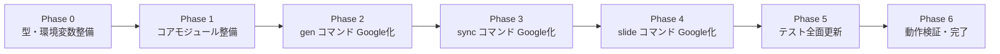

# Gentask: 開発ロードマップとコード構造

## 1. ディレクトリ・アーキテクチャ（実ファイル構成）

プロジェクトは役割に応じて厳格に3層に分離されます。

```
gentask/
├── bin/                          # エントリポイント（CLIコマンド / 実行スクリプト）
│   ├── index.ts                  # gen コマンド: AI タスク生成 + Google デプロイ
│   ├── index.test.ts
│   ├── sync.ts                   # sync コマンド: Calendar → AI → Tasks 同期
│   ├── sync.test.ts
│   ├── slide.ts                  # slide コマンド: 週次スライド処理
│   ├── slide.test.ts
│   ├── google.ts                 # google コマンド: OAuth 管理ヘルパー群
│   └── google.test.ts
│
├── lib/                          # 汎用ライブラリ（副作用なし、再利用可能）
│   ├── types.ts                  # 共有型定義・Zod スキーマ
│   ├── types.test.ts
│   ├── env.ts                    # 必須環境変数バリデーション
│   ├── env.test.ts
│   ├── snapshot.ts               # タスク状態スナップショット（アンドゥ用）
│   └── snapshot.test.ts
│
├── src/                          # コアビジネスロジック
│   ├── google.ts                 # Google OAuth クライアント + API ヘルパー
│   ├── google.test.ts
│   └── google_container_manager.ts  # Google Tasks 12リスト管理
│
├── docs/                         # プロジェクトドキュメント
│   ├── 01_project_concept.md
│   ├── 02_operational_logic.md
│   ├── 03_system_architecture.md
│   └── 04_development_roadmap.md（本ファイル）
│
├── .env.dev                      # Dev 環境変数（コミット不可）
├── .env.prod                     # Prod 環境変数（コミット不可）
├── package.json
├── tsconfig.json
└── vitest.config.ts
```

---

## 2. npm スクリプト一覧

| スクリプト | コマンド | 説明 |
| :--- | :--- | :--- |
| `npm run gen:dev` | `tsx bin/index.ts dev` | Dev: AI タスク生成 + デプロイ |
| `npm run gen:prod` | `tsx bin/index.ts prod` | Prod: AI タスク生成 + デプロイ |
| `npm run sync:dev` | `tsx bin/sync.ts dev` | Dev: Calendar → AI → Tasks 同期 |
| `npm run sync:prod` | `tsx bin/sync.ts prod` | Prod: Calendar → AI → Tasks 同期 |
| `npm run slide:dev` | `tsx bin/slide.ts dev` | Dev: 週次スライド実行 |
| `npm run slide:prod` | `tsx bin/slide.ts prod` | Prod: 週次スライド実行 |
| `npm test` | `vitest run` | 全ユニットテスト実行 |
| `npm run test:watch` | `vitest` | テストウォッチモード |
| `npm run google:auth-url` | `tsx bin/google.ts auth-url` | OAuth 認可 URL 生成 |
| `npm run google:save-token` | `tsx bin/google.ts save-token` | 認可コード → トークン交換・保存 |
| `npm run google:list-cals` | `tsx bin/google.ts list-cals` | アクセス可能なカレンダー一覧 |
| `npm run google:create-event` | `tsx bin/google.ts create-event` | カレンダーイベントのテスト作成 |
| `npm run google:create-task` | `tsx bin/google.ts create-task` | タスクのテスト作成 |

---

## 3. 各コマンドのデータフロー

### `gen` コマンド（bin/index.ts）

```
入力: "第42話 最終決戦"（CLIの第3引数以降）
  │
  ▼
task_flow（Genkit + Gemini）
  → gen_task[] を生成（title / mode / priority / description / label / bucket）
  │
  ▼ 各タスクについて:
google_container_manager.get_container(mode, auth)
  → { current, next, done } リストIDを取得（なければ作成）
  │
  ▼
tasks.tasks.insert({ tasklist: listId, requestBody: { title, notes: description } })
  → taskId を取得
  │
  ▼
calendar.events.insert({ calendarId, requestBody: { extendedProperties.private: { gentask_uuid, gentask_taskId, gentask_listId } } })
  → eventId を取得
  │
  ▼
tasks.tasks.update（タスクのnotesにイベントIDを埋め込み双方向リンク確立）
```

### `sync` コマンド（bin/sync.ts）

```
入力: なし（自動的にカレンダーを参照）
  │
  ▼
calendar.events.list({ privateExtendedProperty: "gentask_uuid", timeMin: GENTASK_SYNC_WINDOW_DAYS日前 })
  → gentask管理イベントのみ取得
  │
  ▼ 各イベントについて:
tasks.tasks.get({ tasklist: listId, task: taskId })
  → current_status（0 or 100）を取得
  → list_map（taskId → listId）を構築
  │
  ▼
sync_flow（Genkit + Gemini）
  → イベント本文 → sync_action[] を生成
  │
  ▼
google_sync_service.apply_actions(actions, list_map)
  → tasks.tasks.update（complete / reschedule / add_note / buffer_consumed / undo）
```

### `slide` コマンド（bin/slide.ts）

```
入力: "第43話 ヒント"（CLIの第3引数以降、省略可）
  │
  ▼ 全モード（PTASK, TTASK, CTASK, ATASK）についてループ:
google_container_manager.get_container(mode, auth)
  │
  ▼
archive_current_week(container, auth, mode)
  [CTASKのみ] 投稿タスク（sub_role === 'post'）完了チェック → false ならスキップ
  current リストの全タスクを done リストへ移動（insert + delete）
  │
  ▼ archiveがtrueの場合:
promote_next_week(container, auth)
  next リストの全タスクを current リストへ移動（due=翌月曜）
  昇格タスク一覧（新しいID）を返す
  │
  ▼
schedule_promoted_tasks(promoted, auth)
  各タスクを PLANNING_SCHEDULE[task.sub_role] に基づきカレンダーへ配置
  calendar.events.insert → eventId 取得
  tasks.tasks.update でタスクノートに双方向リンク埋め込み
  │
  ▼ mode === 'PTASK' の場合のみ:
generate_next_plot(container, episode_hint, auth)
  Gemini AI で次話プロット4件生成
  PTASK の next リストへ tasks.tasks.insert
```

---

## 4. テスト構成

| テストファイル | 対象 | テスト数 |
| :--- | :--- | :--- |
| `bin/google.test.ts` | Google OAuth CLI コマンド | 9 |
| `bin/index.test.ts` | `task_flow`（AI生成フロー） | 3 |
| `bin/sync.test.ts` | `google_sync_service.apply_actions` | ~8 |
| `bin/slide.test.ts` | `archive_current_week` / `promote_next_week` / `schedule_promoted_tasks` / `generate_next_plot` / 日付ユーティリティ | ~18 |
| `lib/env.test.ts` | `validate_env` | 3 |
| `lib/snapshot.test.ts` | `snapshot.save` / `snapshot.restore` | 7 |
| `lib/types.test.ts` | `task_schema` / `sync_action_schema` | 12 |
| `src/google.test.ts` | Google API ヘルパー関数 | 4 |
| `src/google_container_manager.test.ts` | `google_container_manager.get_container` | 5 |
| **合計** | | **69** |

テスト実行方法:

```sh
# 全テスト（タイムゾーン固定で実行）
TZ=Asia/Tokyo npm test
```

> ⚠️ `bin/slide.test.ts` は JST 時刻に依存する日付ユーティリティのテストを含むため、`TZ=Asia/Tokyo` の指定が必要です。

---

## 5. MVP 開発フェーズ（完了済み）

全フェーズ（Phase 0〜10）の実装が完了しています。詳細は `docs/develop_plan_1_overview.md`, `docs/develop_plan_2_details.md`, `docs/develop_plan_3.md` を参照してください。

### フェーズ概要



---

## 6. 検証基準（Success Criteria）

1. `npm run gen:dev -- "タイトル"` 実行で、Google Tasks の正しいリスト（モードと `bucket` 指定に応じた `今週分` or `来週分`）にタスクが作成され、Google Calendar に対応するイベントが作成されること。
2. Google Calendar イベントの本文に「ok」と追記後、`npm run sync:dev` を実行すると Google Tasks の該当タスクが `status: completed` になること。
3. `npm run slide:dev` 実行で、CTASK モードの「今週分」リストに完了済み「投稿」タスクがある場合のみスライドが進み、全モードのアーカイブ→昇格→カレンダー配置→次話生成が完了すること。
4. Google Calendar イベントの本文に `undo` と追記後、`npm run sync:dev` を実行すると直前の操作が取り消されること。
5. 上記サイクルを3回繰り返し、状態の不整合（孤立したタスク、リンク切れ）が発生しないこと。
