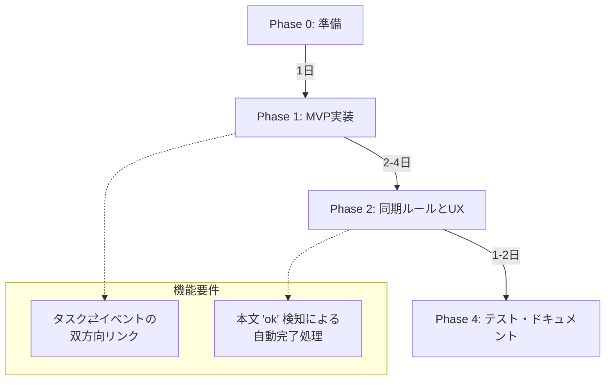

# Gentask: 開発ロードマップとコード構造

## 1. ディレクトリ・アーキテクチャ（関心の分離）

プロジェクトは役割に応じて厳格に3層に分離されます。

```text
gentask/
 ├── bin/       # エントリーポイント (CLIコマンド, 実行スクリプト)
 │    ├── index.ts
 │    ├── sync.ts
 │    ├── google.ts
 │    └── slide.ts
 ├── lib/       # 汎用ライブラリ (APIラッパー, 認証, ユーティリティ)
 │    ├── google-auth.ts
 │    ├── google-tasks.ts
 │    └── google-calendar.ts
 ├── src/       # コアビジネスロジック (AIフロー, 同期ルール, スキーマ)
 │    ├── ai-flow.ts
 │    ├── sync-rules.ts
 │    └── types.ts
 └── .env.* # 環境変数 (Dev/Prod)
```

### `bin` （エントリーポイント / 実行スクリプト）

アプリケーションを直接起動したり、特定のタスクを実行したりするファイル群。

### `lib` （汎用ライブラリ / ユーティリティ）

特定の機能に特化し、複数の場所から再利用される部品となるファイル群。

### `src` （コアビジネスロジック）

エントリーポイントから呼び出され、アプリケーション固有の中核的な処理を担うファイル。

## 2. MVP（Minimum Viable Product）開発フェーズ

Google Tasks と Calendar の双方向同期を実現するプロトタイプの開発計画です。



### 各フェーズの詳細

* **Phase 0 (準備):** GCPプロジェクトのOAuthクライアント設定、Tasks/Calendar API有効化。
* **Phase 1 (MVP実装):** `lib/` へのAPIラッパー実装。CLIエントリは `bin/` に配置し、`npm run gen:dev` / `npm run gen:prod`（`bin/index.ts`）でタスク生成とデプロイ、`npm run sync:dev` / `npm run sync:prod`（`bin/sync.ts`）で同期を実行します。Google 固有のフローは `npm run google:auth-url` 等の `google:*` スクリプト（`bin/google.ts`）を使用します。ID保存による双方向リンク機構の構築。
* **Phase 2 (ルール実装):** カレンダー側の変更（本文に「ok」等）を解析し、Google Tasks側を完了状態にする簡易ルールの実装。
* **Phase 4 (テスト・検証):** 以下の検証基準を満たすか確認。

### 検証基準 (Success Criteria)

1.  `npm run gen:dev -- "タイトル"` 実行で、Tasks と Calendar の両方にアイテムが作成されること。
2.  カレンダーのイベント本文に「ok」を追記後、`npm run sync:dev` を実行すると該当の Task が完了(Completed)になること。
3.  上記サイクルを3回繰り返し、状態の不整合が起きないこと。
