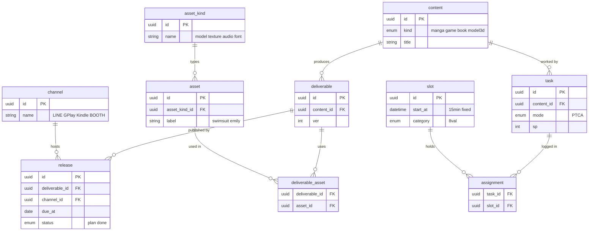

# ER — Phase 1 (Common Skeleton)

> The common skeleton that holds for **every** content kind (manga / app / book / 3D model).
> Kind-specific detail tables (manga_detail with series/edition/episode, app_detail with
> version/stage, book_detail with chapters) are **Phase 2** and are not drawn here.
> Concepts are defined in `new_spec_gentask_JP.md` chapter 5. This file holds the structure only.
>
> **Not fully settled.** This skeleton is a working base, not a fixed result. One known point:
> `deliverable.content_id` ties deliverable to content now, but when Phase 2 detail lands
> (e.g. manga's episode = "renewal #26"), deliverable may re-attach under episode instead.
> So "Phase 1 done" means "the common path is proven", not "these FKs are frozen".

## What Phase 1 proves

Every kind reaches release through the same path: **content → deliverable → release → channel**.

- manga: content → deliverable (JPEG set) → release → channel (LINE Manga)
- app: content → deliverable (apk) → release → channel (Google Play)
- book: content → deliverable (EPUB) → release → channel (Kindle)
- 3D model: content → deliverable (fbx) → release → channel (BOOTH)

Two points that are easy to get wrong (kept here so we do not trip on them again):

- **Anything sold is a deliverable.** A 3D model sold on BOOTH is a **deliverable**, not an asset.
- **An asset is not one physical file.** An asset ("swimsuit emily") is a *reuse label* that
  binds several files (fbx, textures, rig). asset ⇔ file is one-to-many.

## Diagram

## Notes

- **content** is the top container (kind = manga / game / book / model3d). task is tied to content.
- **A 3D model plays two roles, and they are two records, not one.** The same "swimsuit emily"
  can be (a) an **asset** — reused inside manga/app deliverables via `deliverable_asset`, and
  (b) sold on BOOTH as its own **deliverable** under a `model3d` content. Same underlying files,
  two roles, two rows. The asset row and the deliverable row are not merged. (file table = Phase 2.)
- **deliverable** is the unit of release. Its exact identity per kind (manga = edition x number x
  language, app = version, book = chapter/volume, 3D = fbx) is Phase 2.
- **release** carries the deadline (due_at) — the one device that moves the human.
- **deliverable ⇔ asset** is many-to-many through `deliverable_asset` (reuse and tracking).
- **slot** is a fixed 15-minute block; **assignment** carries no time of its own.
- Open for Phase 2: file table (asset ⇔ file, deliverable ⇔ file), ver vs file, kind detail tables.
