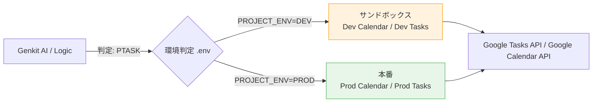

# 初期構築手順

## 1. Gentask の 4 つのコア・タスク概念

Gentask は、タスクを単なる「やるべきこと」ではなく、**「今の自分がどのモード（エネルギー）か」**を基準に 4 つに分類します。

| 概念 (Task Mode) | 性質 | 実行タイミング | Google Tasks リスト |
| --- | --- | --- | --- |
| **PTASK** (Planning) | **思考・言語化** | 高エネルギー（週末午前） | `gentask_PTASK_今週分` etc. |
| **TTASK** (Technical) | **手順確立・実装** | 中エネルギー（平日夜） | `gentask_TTASK_今週分` etc. |
| **CTASK** (Creation) | **手作業・制作** | 低エネルギー（疲労時） | `gentask_CTASK_今週分` etc. |
| **ATASK** (Affairs) | **管理・事務** | 運用・維持（随時） | `gentask_ATASK_今週分` etc. |

## 2. Dev 環境における「4 つの ID 同一」の理屈

論理的には 4 つの役割に分かれていますが、開発・検証（Dev）の段階では、これら 4 つのタスクの「投げ先」をすべて **同一のサンドボックス Google Calendar / Google Tasks** に向けます。

### **なぜ同一にするのか？**

* **安全な破壊と再生:** 開発中はプランを何度も作っては消します。1 つのサンドボックスに集約すれば、本番データを汚す心配なく全機能を検証できます。
* **疎通確認の単純化:** 接続先を 1 つに絞ることで、API の認証や権限エラーの切り分けが容易になります。

## 3. 実行時の動作イメージ（概念図）



## 命名規則

* **リソース名 (GCP名)**: `gentask-app` (kebab-case)
    * 全て小文字、ハイフン繋ぎ。URL制約やミス防止のため
* **環境変数 (Shell/Env)**: `GENTASK_CLIENT_ID` (UPPER_SNAKE_CASE)
    * 全て大文字、アンダースコア繋ぎ。シェルの慣習に従う

## ツールの確認

```sh
node -v
gcloud --version
```

## Google Cloud SDK のインストール（インストール中にいくつか質問（パスを通すか等）が出ますが、すべて Y または Enter で進める）

```sh
curl https://sdk.cloud.google.com | bash
```

## 環境変数を反映

```sh
exec -l $SHELL
```

## 確認

```sh
gcloud --version
Google Cloud SDK 550.0.0
bq 2.1.26
bundled-python3-unix 3.13.10
core 2025.12.12
gcloud-crc32c 1.0.0
gsutil 5.35
```

## 命名ルール（統合版）

* リソース名 (GCP): `gentask-app-dev` / `gentask-app-prod`
* 環境変数ファイル: `.env.dev` / `.env.prod`

## Google Cloud CLI ログイン

```sh
# 1. ログイン実行
# ブラウザが立ち上がるので、GCPを利用するアカウントで承認してください。
gcloud auth login
```

## Google Cloud プロジェクト作成

```sh
# 1. 開発用プロジェクト作成
export DEV_GCP_PROJECT_ID="gentask-dev"
gcloud projects create "$DEV_GCP_PROJECT_ID" --name="gentask-dev"

# 2. 本番用プロジェクト作成
export PROD_GCP_PROJECT_ID="gentask-prod"
gcloud projects create "$PROD_GCP_PROJECT_ID" --name="gentask-prod"
```

```sh
# DEV環境の記録
echo "PROJECT_ENV=DEV" >> .env.dev
echo "GCP_PROJECT_ID=$DEV_GCP_PROJECT_ID" >> .env.dev

# PROD環境の記録
echo "PROJECT_ENV=PROD" >> .env.prod
echo "GCP_PROJECT_ID=$PROD_GCP_PROJECT_ID" >> .env.prod
```

## Google Cloud プロジェクト 課金アカウントの紐付け

```sh
# 課金アカウントIDを自動で取得して変数に格納
export GCP_BILLING_ID=$(gcloud billing accounts list --format="value(name)" --limit=1)

# 取得できたか確認（ここだけ目視してください）
echo "Using Billing Account: $GCP_BILLING_ID"
```

```sh
# 1. DEV プロジェクトの紐付け
gcloud billing projects link "$DEV_GCP_PROJECT_ID" --billing-account "$GCP_BILLING_ID"

# 2. PROD プロジェクトの紐付け
gcloud billing projects link "$PROD_GCP_PROJECT_ID" --billing-account "$GCP_BILLING_ID"
```

```sh
# 両方のプロジェクトが billingEnabled: true になっているか確認
gcloud billing projects list --billing-account "$GCP_BILLING_ID"
```

```sh
# DEVに追記
echo "GCP_BILLING_ID=$GCP_BILLING_ID" >> .env.dev

# PRODに追記
echo "GCP_BILLING_ID=$GCP_BILLING_ID" >> .env.prod
```

## Google Cloud API の有効化

### Vertex AI API（Gemini 用）

```sh
# DEV
gcloud config set project "$DEV_GCP_PROJECT_ID"
gcloud services enable aiplatform.googleapis.com

# PROD
gcloud config set project "$PROD_GCP_PROJECT_ID"
gcloud services enable aiplatform.googleapis.com

# DEV に戻す（事故防止）
gcloud config set project "$DEV_GCP_PROJECT_ID"
```

### Generative Language API

```sh
gcloud services enable generativelanguage.googleapis.com --project="$DEV_GCP_PROJECT_ID"
gcloud services enable generativelanguage.googleapis.com --project="$PROD_GCP_PROJECT_ID"
```

### Google Tasks API / Google Calendar API（OAuth 経由で使用）

GCP コンソール → 「APIとサービス」→「ライブラリ」から DEV/PROD 両プロジェクトで以下を有効化してください：

* **Google Tasks API**
* **Google Calendar API**

### 管理用 API

```sh
gcloud services enable cloudresourcemanager.googleapis.com --project="$DEV_GCP_PROJECT_ID"
gcloud services enable cloudresourcemanager.googleapis.com --project="$PROD_GCP_PROJECT_ID"
```

## サービスアカウントと権限設定（Gemini 用）

```sh
# DEV: AI操作専用のサービスアカウント作成
gcloud config set project "$DEV_GCP_PROJECT_ID"
gcloud iam service-accounts create gentask-api-user \
    --display-name="Gentask API Service Account (Dev)"

gcloud projects add-iam-policy-binding "$DEV_GCP_PROJECT_ID" \
    --member="serviceAccount:gentask-api-user@$DEV_GCP_PROJECT_ID.iam.gserviceaccount.com" \
    --role="roles/aiplatform.user"
```

```sh
# PROD: サービスアカウント作成
gcloud config set project "$PROD_GCP_PROJECT_ID"
gcloud iam service-accounts create gentask-api-user \
    --display-name="Gentask API Service Account (Prod)"

gcloud projects add-iam-policy-binding "$PROD_GCP_PROJECT_ID" \
    --member="serviceAccount:gentask-api-user@$PROD_GCP_PROJECT_ID.iam.gserviceaccount.com" \
    --role="roles/aiplatform.user"
```

## API キーの作成（Gemini 用）

```sh
# DEV
gcloud alpha services api-keys create --display-name="vertex-ai-key" --project="$DEV_GCP_PROJECT_ID"

# PROD
gcloud alpha services api-keys create --display-name="vertex-ai-key" --project="$PROD_GCP_PROJECT_ID"
```

`.env` ファイルに保存:

```sh
DEV_KEY_UID=$(gcloud alpha services api-keys list \
    --project="$DEV_GCP_PROJECT_ID" \
    --filter="displayName:vertex-ai-key" \
    --format="value(name.scope().segment(-1))")

DEV_KEY_VAL=$(gcloud alpha services api-keys get-key-string \
    "projects/${DEV_GCP_PROJECT_ID}/locations/global/keys/${DEV_KEY_UID}" \
    --format="value(keyString)")

if [ -n "$DEV_KEY_VAL" ]; then
    echo "GCP_VERTEX_AI_API_KEY=$DEV_KEY_VAL" >> .env.dev
    echo "Successfully saved to .env.dev"
fi
```

```sh
PROD_KEY_UID=$(gcloud alpha services api-keys list \
    --project="$PROD_GCP_PROJECT_ID" \
    --filter="displayName:vertex-ai-key" \
    --format="value(name.scope().segment(-1))")

PROD_KEY_VAL=$(gcloud alpha services api-keys get-key-string \
    "projects/${PROD_GCP_PROJECT_ID}/locations/global/keys/${PROD_KEY_UID}" \
    --format="value(keyString)")

if [ -n "$PROD_KEY_VAL" ]; then
    echo "GCP_VERTEX_AI_API_KEY=$PROD_KEY_VAL" >> .env.prod
    echo "Successfully saved to .env.prod"
fi
```

### 疎通確認（Gemini）

```sh
export DEV_KEY=$(grep GCP_VERTEX_AI_API_KEY .env.dev | cut -d '=' -f2)

curl -X POST \
  -H "Content-Type: application/json" \
  -d '{"contents": [{"parts": [{"text": "Hello Gemini 2.0 Flash!"}]}]}' \
  "https://generativelanguage.googleapis.com/v1beta/models/gemini-2.0-flash:generateContent?key=${DEV_KEY}"
```

## OAuth 2.0 クレデンシャルの作成（Google Tasks / Calendar 用）

Google Tasks API と Google Calendar API は OAuth 2.0 で認証します。

1. GCP コンソール → 「APIとサービス」→「認証情報」→「認証情報を作成」→「OAuth クライアント ID」
2. アプリケーションの種類: **デスクトップアプリ**
3. 名前: `gentask-oauth-dev`（DEV用）/ `gentask-oauth-prod`（PROD用）
4. 作成後、**クライアントID** と **クライアントシークレット** を取得

```sh
# DEV
echo "GOOGLE_CLIENT_ID=<your-dev-client-id>" >> .env.dev
echo "GOOGLE_CLIENT_SECRET=<your-dev-client-secret>" >> .env.dev
echo "GOOGLE_CALENDAR_ID=<your-dev-calendar-id>" >> .env.dev

# PROD
echo "GOOGLE_CLIENT_ID=<your-prod-client-id>" >> .env.prod
echo "GOOGLE_CLIENT_SECRET=<your-prod-client-secret>" >> .env.prod
echo "GOOGLE_CALENDAR_ID=<your-prod-calendar-id>" >> .env.prod
```

## Node.js 依存パッケージのインストール

```sh
npm install
```

## 環境変数ファイルの完成形

`.env.dev` / `.env.prod` に以下の変数が揃っていることを確認してください：

| 変数名 | 説明 |
| :--- | :--- |
| `GCP_VERTEX_AI_API_KEY` | Gemini 2.0 Flash API キー |
| `GOOGLE_CLIENT_ID` | OAuth 2.0 クライアントID |
| `GOOGLE_CLIENT_SECRET` | OAuth 2.0 クライアントシークレット |
| `GOOGLE_CALENDAR_ID` | 操作対象の Google Calendar ID |
| `GOOGLE_REDIRECT_URI` | （省略可）デフォルト: `urn:ietf:wg:oauth:2.0:oob` |
| `GOOGLE_TOKEN_PATH` | （省略可）デフォルト: `.google_token.json` |
| `GENTASK_SYNC_WINDOW_DAYS` | （省略可）sync の参照日数。デフォルト: `365` |

## Google OAuth トークンの取得

```sh
# 1. 認可 URL を生成（DEV 環境）
npm run google:auth-url -- dev
# → ブラウザで URL を開き、Google アカウントで承認

# 2. 認可コードをトークンに交換して保存
npm run google:save-token -- dev <認可コード>
# → .google_token.json（またはGOOGLE_TOKEN_PATHで指定したファイル）に保存される
```

## 動作確認

```sh
# カレンダー一覧を表示して疎通確認
npm run google:list-cals -- dev

# AI タスク生成テスト（DEV 環境）
npm run gen:dev -- "第1話 テスト"

# 全ユニットテスト
TZ=Asia/Tokyo npm test
```

